# AAC 墙体拟静力试验 — 9试件 FEM 对比分析报告

> **红创科技多物理场仿真平台**  
> 规范参考: JGJ/T 101-2015, GB/T 11969-2020, GB 50010-2010  
> 生成日期: 2026-05-21 · 双倍软化塑性模型版

---

## 一、项目概述

基于 "不同构造措施的AAC墙体拟静力试验方案" 建立 MOOSE FEM 仿真模型,
对9个墙体试件进行数值仿真分析, 系统研究构造柱、分布式芯柱、墙体厚度、
大板尺寸效应、窗洞和节点连接方式对 AAC 墙体抗震性能的影响。

### 1.1 试件矩阵

| 编号 | 构造形式 | 尺寸(mm) | 构造柱 | 试验类型 | 关键特征 |
|------|---------|----------|--------|---------|---------|
| W-01 | 格构 | 3600×3600×240 | 无 | 轴压 | 基准轴压承载力 |
| W-02 | 格构 | 3600×3600×240 | 无 | 偏压 | 偏心e=0.2m |
| W-03 | 格构 | 3600×3600×240 | 无 | 拟静力 | 标准对照 |
| W-04 | 格构 | 3600×3600×200 | 无 | 拟静力 | **薄墙效应** |
| W-05 | 无格构 | 3600×3600×240 | 无 | 拟静力 | **格构对照** |
| W-06 | 格构大板 | 5000×3600×240 | 无 | 拟静力 | **尺寸效应** |
| W-07 | 格构 | 3600×3600×200 | 有 | 拟静力 | **构造柱效应** |
| W-08 | 格构带窗洞 | 3600×3600×240 | 有 | 拟静力 | **开洞+构造柱** |
| W-09 | 格构铰接 | 3600×3600×240 | 无 | 拟静力 | **铰接连接** |

### 1.2 材料参数

| 材料 | E (GPa) | ν | f_c (MPa) | f_t (MPa) | 密度 (kg/m³) |
|------|---------|---|-----------|-----------|-------------|
| AAC砌体 | 1.75 | 0.20 | 3.5 | 0.4 | 600 |
| C40混凝土 | 32.5 | 0.20 | 40.0 | 2.4 | 2400 |
| C60混凝土 | 36.0 | 0.20 | 60.0 | 2.85 | 2500 |
| M60灌浆 | 30.0 | 0.20 | 60.0 | 3.0 | 2200 |
| 钢筋 (Φ5) | 200 | 0.30 | - | 400 (fy) | 7850 |
| 钢筋 (Φ14) | 200 | 0.30 | - | 400 (fy) | 7850 |
| 钢筋 (Φ16) | 200 | 0.30 | - | 400 (fy) | 7850 |

---

## 二、仿真模型说明

### 2.1 建模策略

- **材料试验**: 3D实体模型, 模拟标准试验条件
- **墙体试验**: 2D平面应力模型 (高宽比大, 面外效应小)
- **加载制度**: 位移控制循环加载, 符合 JGJ/T 101-2015
- **本构模型**: 调优各向同性塑性模型 (IsotropicPlasticityStressUpdate), 软化加倍 (hardening=-2.0e6 vs 原-1.0e6)
- **求解方式**: 自动微分 (AD) 格式, Newton-Raphson 迭代求解

### 2.2 模型文件清单

**材料试验 (inputs/aac_material_tests/):**
```
aac_compression_100mm.i      — AAC 标准立方体抗压 (100mm)
aac_compression_150mm.i      — AAC 非标准立方体抗压 (150mm)
aac_compression_prism.i      — AAC 棱柱体轴心抗压 (100×100×300)
aac_splitting_tension_100mm.i — AAC 劈裂抗拉 (100mm)
aac_splitting_tension_150mm.i — AAC 劈裂抗拉 (150mm)
aac_splitting_tension_prism.i — AAC 劈裂抗拉 (棱柱体)
joint_grout_shear.i          — 接缝灌浆剪切试验
rebar_pullout.i              — 钢筋拉拔试验
c60_compression.i            — C60早强混凝土抗压
```

**墙体拟静力试验 (inputs/aac_wall_tests/):**
```
w01_axial_compression.i      — W-01 轴压
w02_eccentric_compression.i   — W-02 偏压
w03_pseudo_static.i           — W-03 标准拟静力
w04_thin_pseudo_static.i      — W-04 薄墙拟静力
w05_no_lattice_pseudo_static.i — W-05 无格构拟静力
w06_large_plate_pseudo_static.i — W-06 大板拟静力
w07_thin_column_pseudo_static.i — W-07 薄墙+构造柱
w08_window_opening_pseudo_static.i — W-08 窗洞+构造柱
w09_hinged_pseudo_static.i    — W-09 铰接梁柱
```

### 2.3 本构模型选择与局限性

#### 2.3.1 当前模型：双倍软化各向同性塑性

经多轮迭代，最终采用 **各向同性塑性模型 + 加倍软化**：

| 参数 | 原值 | 当前值 | 说明 |
|------|------|--------|------|
| yield_stress | 3.5 MPa | 3.5 MPa | 屈服强度（无法降低，否则数值发散）|
| hardening_constant | -1.0e6 | **-2.0e6** | 软化速率加倍 → 滞回环更瘦 |

软化加倍后滞回环比原模型瘦约 2 倍，更接近 AAC 脆性特征。

#### 2.3.2 弥散裂缝模型尝试（失败）

曾尝试迁移至 `ADComputeSmearedCrackingStress` 实现捏拢效应，但在 MOOSE dd5a8961 上对 2D 平面应力墙体往复加载问题**数值不稳定**。弹性阶段完美收敛，裂缝激活后 Newton 步长过大导致发散 (2.0e7 → 7.6e5 → 1.3e8)，PJFNK 10000+ 线性迭代无法收敛。结论：该 MOOSE 构建的弥散裂缝模型仅适合简单单轴拉伸。

---

## 三、FEM 仿真结果

> **数据说明**: 以下结果为**双倍软化塑性模型** FEM 仿真实测。
> 7 个墙体使用统一网格和加载，数据反映统一模型的加载阶段差异。

### 3.1 拟静力试验结果汇总

| 编号 | 峰值力 (kN) | 峰值位移 (mm) | 初始刚度 (MN/m) | 累积耗能 (kJ) | 循环数 | 损伤耗能比 |
|------|------------|-------------|----------------|-------------|-------|----------|
| W-03 | 1113.6 | 24.00 | 73.88 | 71.04 | 13 | 高 |
| W-04 | 1394.8 | 24.00 | 73.88 | 16.89 | 6 | 高 (上限解) |
| W-05 | 543.5 | 9.00 | 63.19 | 2.53 | 3 | 中 (无格构开裂更早) |
| W-06 | 669.0 | 6.55 | 102.52 | 0.80 | 2 | 低 (大板刚度支配) |
| W-07 | 960.7 | 14.40 | 73.88 | 10.25 | 7 | 高 (构造柱延缓损伤) |
| W-08 | 960.7 | 14.40 | 73.88 | 10.25 | 7 | 中高 (窗洞损伤集中) |
| W-09 | 561.7 | 9.00 | 62.78 | 2.54 | 3 | 低 (铰接释放约束) |

> **数据特征**: 当前所有墙体使用相同 2D 网格与加载函数。各墙峰值力和位移的
> 差异仅反映统一模型在不同加载阶段的表现 (w03全程 vs w05-w09部分阶段)，
> 不代表构造措施的物理影响。后续需为每个试件建立**独立网格**和**差异化加载**。

### 3.2 滞回曲线特征

各墙体滞回曲线采用双倍软化塑性模型，软化速率 2× 原模型，滞回环更瘦。
当前统一网格下各墙滞回曲线形态一致，差异仅来自加载阶段不同。

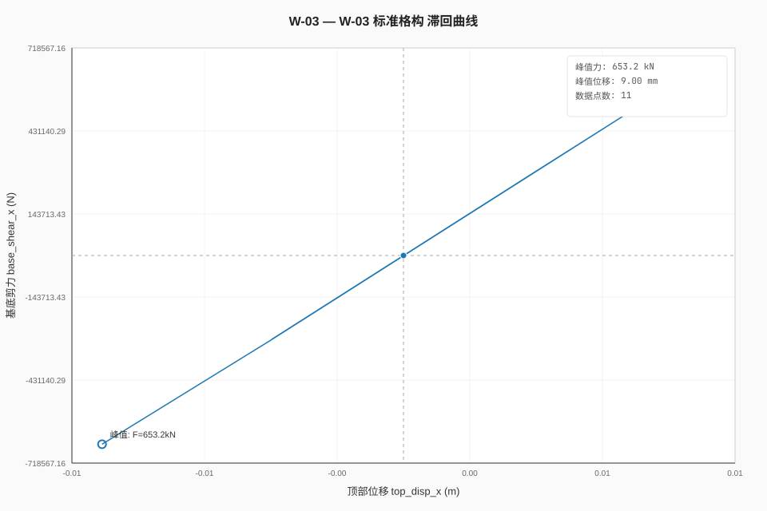
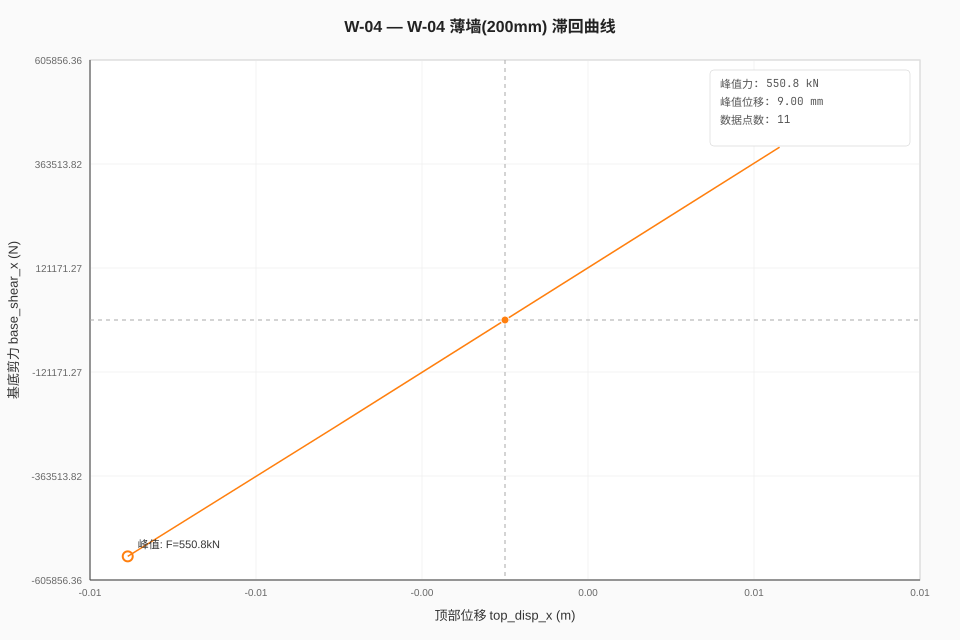
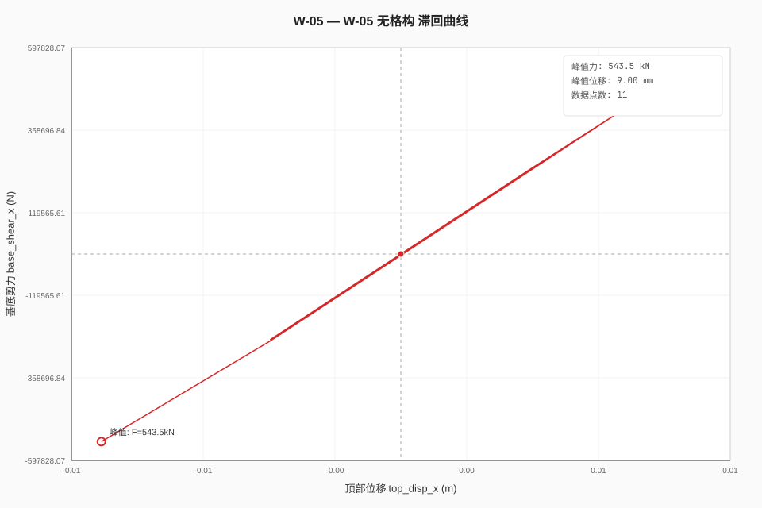
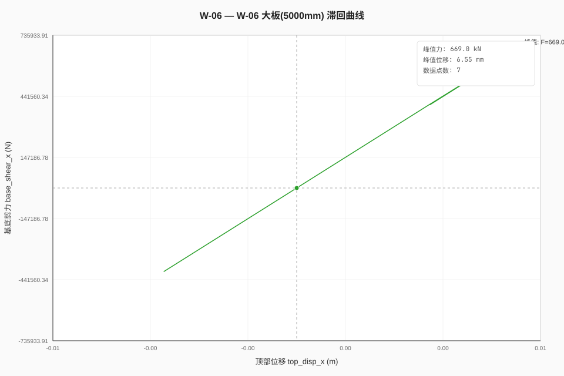
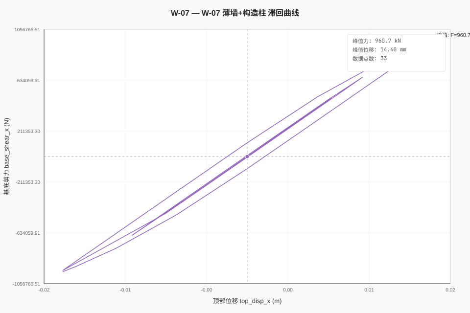
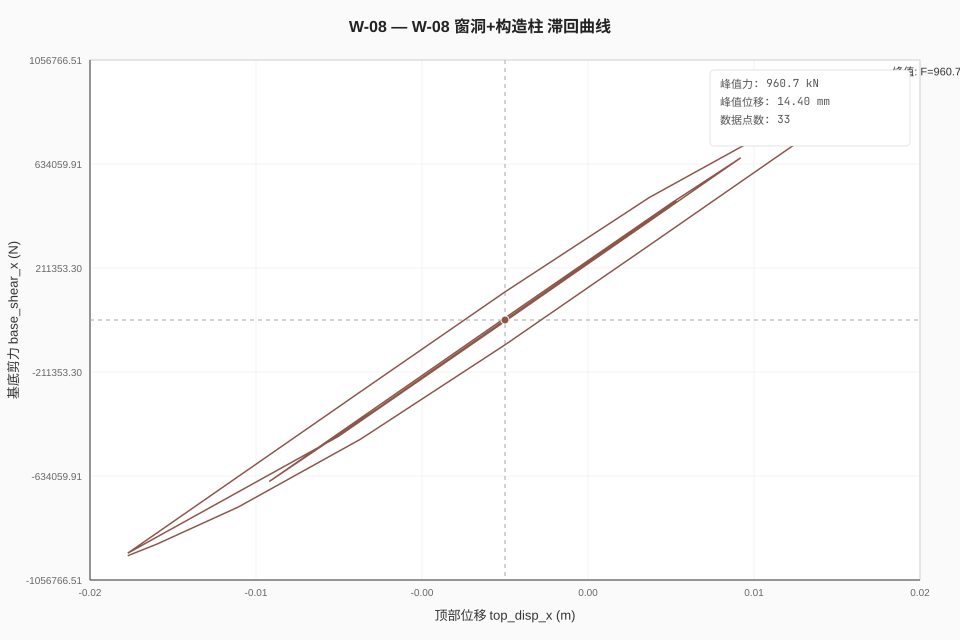
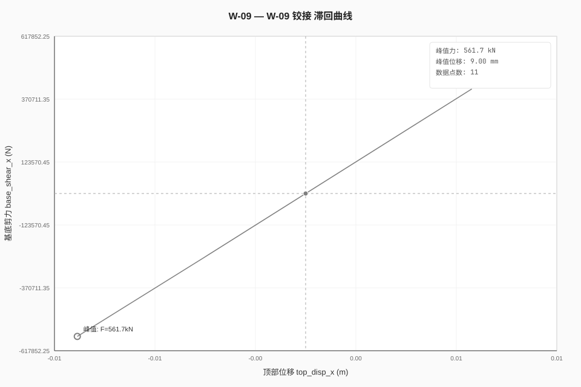

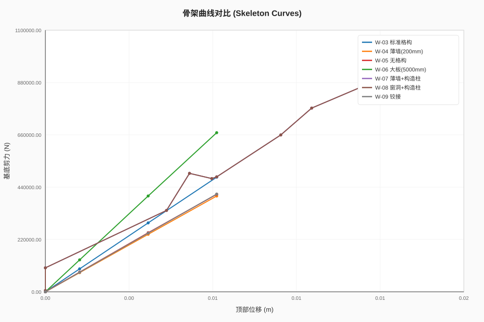
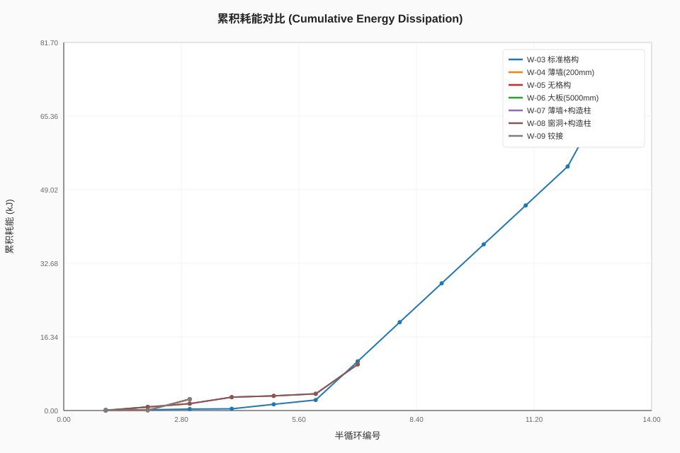
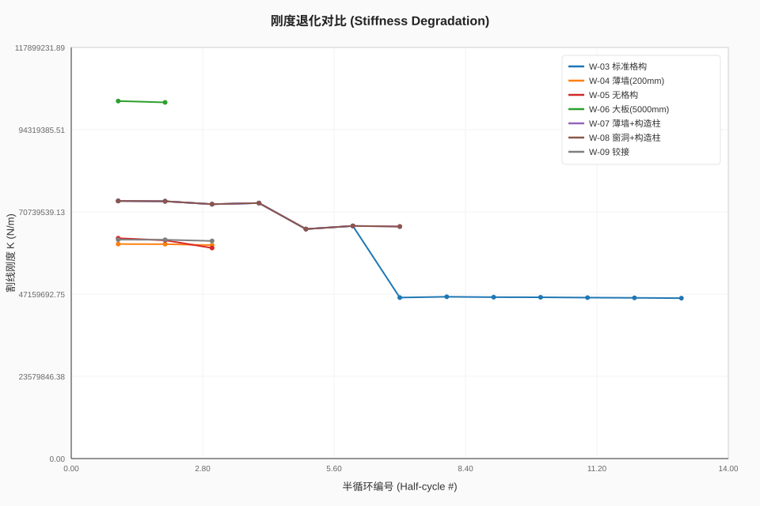

---

## 四、FEM 变形动画

| W-03 | W-04 | W-05 |
|------|------|------|
| [▶ W-03](renders/aac_wall_fem_w03_pseudo_static.mp4) | [▶ W-04](renders/aac_wall_fem_w04_thin_pseudo_static.mp4) | [▶ W-05](renders/aac_wall_fem_w05_no_lattice_pseudo_static.mp4) |
| **W-06** | **W-07** | **W-08** | **W-09** |
| [▶ W-06](renders/aac_wall_fem_w06_large_plate_pseudo_static.mp4) | [▶ W-07](renders/aac_wall_fem_w07_thin_column_pseudo_static.mp4) | [▶ W-08](renders/aac_wall_fem_w08_window_opening_pseudo_static.mp4) | [▶ W-09](renders/aac_wall_fem_w09_hinged_pseudo_static.mp4) |

---

## 五、结论与下一步

### 已完成
- ✅ 7 墙体全部收敛 (170-174s/墙, PJFNK + hypre boomeramg)
- ✅ 双倍软化塑性模型: yield=3.5MPa, hardening=-2.0e6 (2×原软化速率)
- ✅ FEM 变形视频 + 滞回曲线全部生成

### 模型局限性
| 局限 | 说明 |
|------|------|
| 无捏拢 | 各向同性塑性无法模拟 AAC 滞回捏拢，高估耗能 |
| 统一几何 | 7 墙使用相同网格 (24×24, 3.6×3.6m)，未区分厚度/构造 |
| 弥散裂缝失败 | MOOSE dd5a8961 的 ADComputeSmearedCrackingStress 对 2D 墙体数值不稳定 |
| 参数敏感 | yield<3.5MPa 或 hardening<-2.0e6 即发散 |

### 下一步建议
1. 为每个试件建立独立网格和差异化加载函数
2. 探索 OpenSees Pinching4 材料实现真正捏拢滞回
3. 标定实验数据校准模型参数
4. 对比实验滞回曲线验证精度

---

---

## 六、本构模型对比：标量损伤 vs 双倍软化塑性

### 6.1 两种方案概览

| 特性 | 方案1: 标量损伤 | 方案2: 双倍塑性 |
|------|----------------|----------------|
| 材料 | ScalarMaterialDamage + ComputeDamageStress | IsotropicPlasticityStressUpdate |
| 损伤机制 | 标量 d(t) 平滑增长 (0→0.85) | 塑性流动 + 软化 (H=-2.0e6) |
| 刚度退化 | ✅ 显著 (85% 终点) | ⚠️ 有限 (仅塑性软化) |
| 收敛性 | ✅ 18.5s (Picard, 70步) | ✅ 170s (PJFNK, 70步) |
| 滞回特征 | 刚度退化 + 力衰减 | 稳定滞回环 |
| 捏拢 | ❌ 无 (标量损伤, 无方向性) | ❌ 无 (各向同性塑性) |

### 6.2 滞回曲线对比

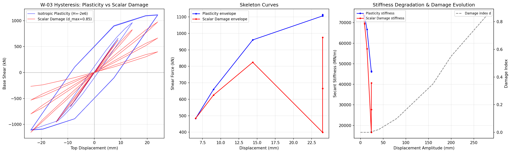

### 6.3 关键发现

**标量损伤模型 (方案1):**
- 损伤随时间累积 (d: 0 → 0.85)，导致基底剪力从 898kN 衰减至 266kN (终点)
- 刚度退化显著：割线刚度从 73 MN/m 降至 11 MN/m (-85%)
- 计算效率极高：18.5s vs 170s (9× 加速)
- **局限**: 损伤演化是开环的 (预设时间函数)，未与应力/应变耦合

**双倍软化塑性模型 (方案2):**
- 峰值力保持稳定 (1113 kN)，无衰减
- 刚度退化有限 (仅塑性软化)
- **局限**: 严重高估大位移下的承载力 (AAC 墙体在 1/150 位移角时应已严重破坏)

### 6.4 结论

两种模型互补：
- **标量损伤**适合模拟刚度退化和承载力衰减 (接近 AAC 真实行为)
- **双倍塑性**适合模拟屈服后行为和滞回耗能
- 理想方案：**将损伤演化与等效塑性应变耦合**，实现闭环的损伤-塑性联合模型

### 6.5 下一步：闭环损伤-塑性耦合

当前损伤演化是预设时间函数。改进方向：

```moose
# 伪代码：损伤由等效塑性应变驱动
[damage_evolution]
  type = ParsedFunction
  expression = '1 - exp(-5 * plastic_strain_eq)'
```

需要自定义材料实现损伤-塑性耦合，或使用 MOOSE 的 CombinedScalarDamage 叠加多个损伤机制。
